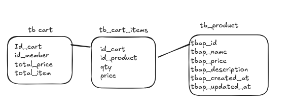
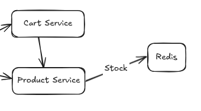
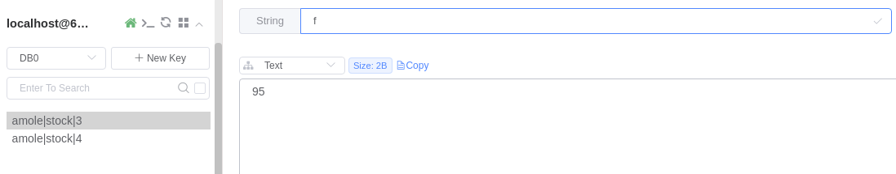

# Amole Cart and Product Service Documentation
This article for my cart and product documentation. The purpose of these 2 services is to handle carts when users add to cart and products for users to view products. There is also communication between these 2 services, the cart service will hit the product to check product details and retrieve stock from the product.
## Design RDBMS


## How Communaction between service cart and product 


## How To Install and Run
```
I'm using docker for the database
1. Look at Makefile there is 5 command using make should be run
    - make postgres (for create container docker for postgres)
    - make createdb (for create db on the container)
    - make migrateup (for migrate all migrations file to database)
    - make redis-product (for make redis container)
2. Add stock for product in redis-product conainer with patern like "amole|stock|{id_product}" and out the stock
3. Using MOCK_DATA1.csv or MOCK_DATA2.csv for import to table product
4. For run the program just command in terminal "ENV=development go run cmd/main.go"
5. For test the program in postman i just put file "amole service.postman_collection.json" for example add to cart and get product
```
## Image for example redis stock



## Reason why using this pattern
This pattern divides the program according to the existing parts, for example, the api will contain how we connect with other services, cmd is the main focus of the program, internal is a folder that contains folders from the core programm regarding, service how the application logic, repository how the application relates to the database, handler how the application can be hit from other applications, config how to configure the application. etc. for the script folder itself is a folder that contains scripts that are needed to generate databases and queries because I use sqlc.
